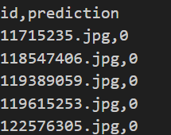

# 图像分类标注小工具
来源： [CSDN连接]https://blog.csdn.net/zengwubbb/article/details/124653498

## 使用方法
安装好需要的包（代码中import的包）  

同目录下创建data_all文件夹，传入所需标注的图片  

修改代码中的图片路径与类别个数，运行代码   

通过键盘操作完成标注。  按 0~cls_num-1 进行图片的类别标注，标注完成后会形成各个类别的文件夹。  

左键返回上一张重新标注，右键跳过，'d' 表示不确定，放入unconfirmed文件夹。  

较原CSDN代码添加了csv文件输出，一列为图片名，一列为标注类别。  

添加了断点续标功能，在标注中途不小心中断可重新运行进行标注，会跳过已标注图片。
